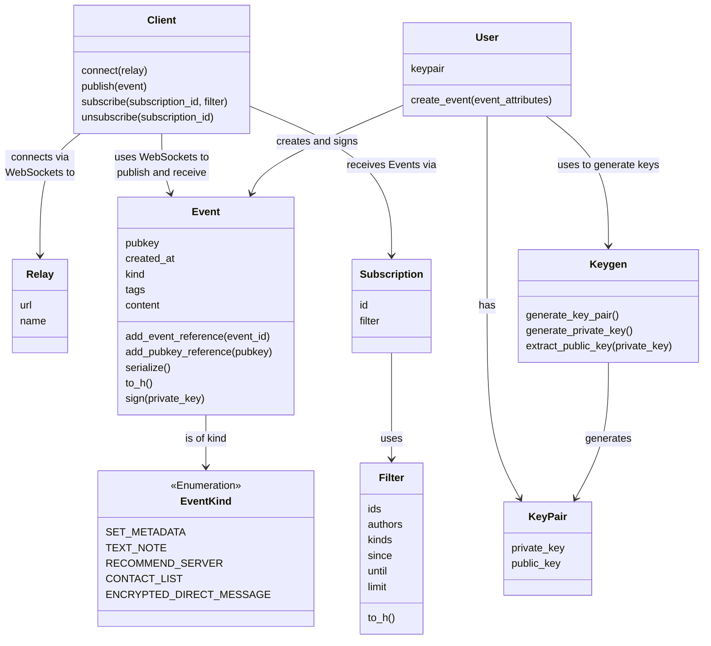

# Getting started

This gem abstracts the complexity that you would face when trying to connect to relays web sockets, send and receive
events, handle events callbacks and much more.

## Visual overview

Begin your journey with an overview of the essential functions. A visual representation below maps out the key
components we'll delve into in this section.



## Code overview

Explore the provided code snippet to learn about initializing the Nostr [client](../core/client.md), generating
a [keypair](../core/keys), [publishing](../relays/publishing-events) an event, and
efficiently [managing event subscriptions](../subscriptions/creating-a-subscription) (including event reception,
filtering, and WebSocket event handling).

```ruby
# Require the gem
require 'nostr'

# Instantiate a client
client = Nostr::Client.new

# a) Use an existing keypair
keypair = Nostr::KeyPair.new(
  private_key: 'your-private-key',
  public_key: 'your-public-key',
)

# b) Or create a new keypair
keygen = Nostr::Keygen.new
keypair = keygen.generate_keypair

# Create a user with the keypair
user = Nostr::User.new(keypair: keypair)

# Create a signed event
text_note_event = user.create_event(
  kind: Nostr::EventKind::TEXT_NOTE,
  content: 'Your feedback is appreciated, now pay $8'
)

# Connect asynchronously to a relay
relay = Nostr::Relay.new(url: 'wss://nostr.wine', name: 'Wine')
client.connect(relay)

# Listen asynchronously for the connect event
client.on :connect do
  # Send the event to the Relay
  client.publish(text_note_event)

  # Create a filter to receive the first 20 text notes
  # and encrypted direct messages from the relay that
  # were created in the previous hour
  filter = Nostr::Filter.new(
    kinds: [
      Nostr::EventKind::TEXT_NOTE,
      Nostr::EventKind::ENCRYPTED_DIRECT_MESSAGE
    ],
    since: Time.now.to_i - 3600, # 1 hour ago
    until: Time.now.to_i,
    limit: 20,
  )

  # Subscribe to events matching conditions of a filter
  subscription = client.subscribe(filter)

  # Unsubscribe from events matching the filter above
  client.unsubscribe(subscription.id)
end

# Listen for incoming messages and print them
client.on :message do |message|
  puts message
end

# Listen for error messages
client.on :error do |error_message|
  # Handle the error
end

# Listen for the close event
client.on :close do |code, reason|
  # You may attempt to reconnect to the relay here
end
```

Beyond what's covered here, the Nostr protocol and this gem boast a wealth of additional functionalities. For an
in-depth exploration of these capabilities, proceed to the next page.
